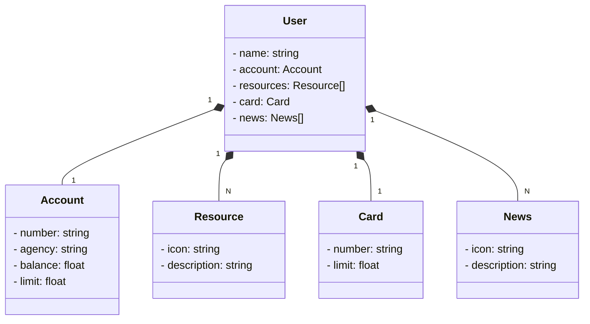

# Santander bootcamp 2023
Java RESTful API criada para Santander Dev Week.

## Diagrama de classes

```mermaid

classDiagram
  class User {
    - name: string
    - account: Account
    - resources: Resource[]
    - card: Card
    - news: News[]
  }

  class Account {
    - number: string
    - agency: string
    - balance: float
    - limit: float
  }

  class Resource {
    - icon: string
    - description: string
  }

  class Card {
    - number: string
    - limit: float
  }

  class News {
    - icon: string
    - description: string
  }

User "1" *-- "1" Account 
User "1" *-- "N" Resource
User "1" *-- "1" Card
User "1" *-- "N" News
```
